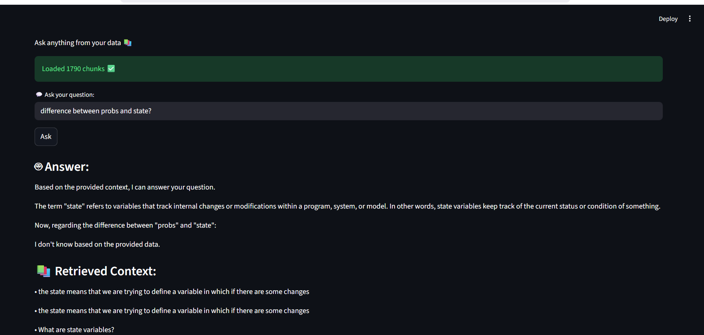

# 🤖 RAG AI Chatbot

A powerful Retrieval-Augmented Generation (RAG) chatbot built using **Python, Streamlit, and Ollama**.

---

## 🚀 Features

* 🔍 Semantic Search using embeddings (bge-m3)
* 🧠 Local LLM (llama3 via Ollama)
* 💬 Context-aware answers
* ❌ No hallucination (strict prompt)
* ⚡ Fast & fully offline

---

## 🛠️ Tech Stack

* Python
* Streamlit
* Ollama
* NumPy

---

## 📂 Project Structure

```
├── app.py              # Streamlit UI
├── rag_query.py        # Query + retrieval logic
├── Read_chunks.py      # Embedding generator
├── jsons/              # Processed chunks + embeddings
├── audios/             # Input audio files
├── whisper/            # Speech-to-text
```

---

## ▶️ Run Locally

### 1. Clone repo

git clone https://github.com/Md-shanawaj0001/rag-ai-chatbot.git
cd rag-ai-chatbot
```

### 2. Activate venv

```bash
.venv\Scripts\activate
```

### 3. Start Ollama

```bash
ollama serve
```

### 4. Run app

```bash
streamlit run app.py
```

---

## 📸 Demo


 
---

## 💡 Example Questions

* What is React props?
* Explain useState with example
* Difference between props and state

---

## ⚠️ Note

This chatbot only answers based on provided data.
If answer is not found → it will say:

> "I don't know based on the provided data."

---

## 👨‍💻 Author

Md Shanawaj
